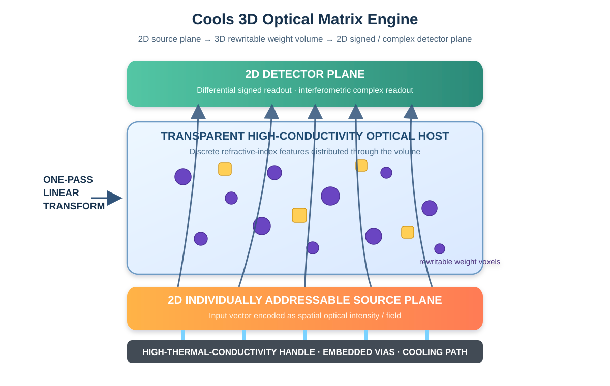
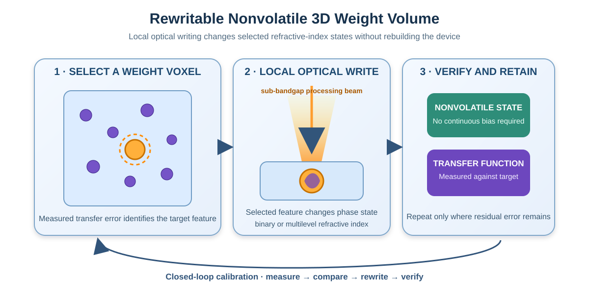
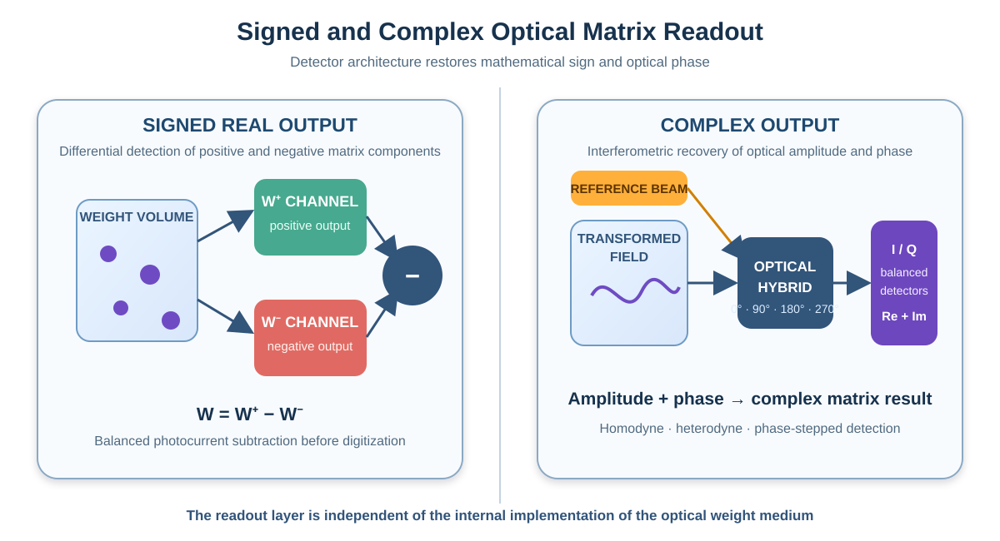

# Cools 三维光学矩阵计算引擎

[English](README.md) | [한국어](README_KR.md) | [专利组合](PATENT_PORTFOLIO.md) | [公开与知识产权声明](PUBLIC_NOTICE.md)

## 不再堆叠权重平面，而是把矩阵写入光学体积；无需重制器件即可重写权重。

**Cools 提出一种垂直集成光子计算引擎：二维光源面、三维折射率权重体积和二维探测面被集成在一个热稳定的光学主体中。**

该结构不依赖多层平面调制膜，而是把目标线性变换编码为分布在光路体积内部的离散折射率特征。输入光场只需穿过权重体积一次即可映射到探测面。选定的权重特征可以局部重写，差分探测与干涉探测则进一步支持有符号实数矩阵和复数矩阵运算。



---

## 1. 传统光计算的结构性瓶颈

传统自由空间光计算通常在发光面与探测面之间设置一个或多个二维调制平面，由此产生以下限制：

- 独立权重数量受平面像素数限制；
- 多平面叠层需要严格的层间对准；
- 层间界面会累积光学误差；
- 固定掩模在目标变换改变后必须重新制造。

此外，光强本身不能为负，普通强度探测也无法直接保留光场相位。因此，实用的光学矩阵引擎不仅需要三维权重介质，还需要恢复符号和复数信息的探测结构。

---

## 2. Cools 基本架构

```text
二维探测面
（差分有符号读出 / 干涉复数读出）
────────────────────────────────
透明光路区域
+ 三维离散折射率特征
= 折射率权重体积
────────────────────────────────
二维独立寻址光源面
────────────────────────────────
高导热手柄 · 嵌入式通孔 · 冷却路径
```

| 组成部分 | 主要功能 |
|---|---|
| 二维光源面 | 将输入向量编码为空间光场分布 |
| 三维折射率权重体积 | 在光传播过程中执行目标线性变换 |
| 二维探测面 | 将输出分布转换为电信号 |
| 差分读出 | 得到有符号实数输出 |
| 干涉读出 | 恢复相位与复数输出 |
| 高导热光学主体 | 提供光传播、机械支撑和热稳定 |
| 嵌入式通孔与冷却结构 | 提供垂直寻址和热抽取 |

---

## 3. 从平面权重转向体积权重

权重介质由多个与周围光学主体折射率不同的离散区域构成。每个特征的位置、尺寸、折射率反差和状态依据目标矩阵或神经网络层的传递函数进行设计。

代表性折射率特征可包括：

- 高折射率嵌入区；
- 多孔低折射率区；
- 局部掺杂区；
- 晶态或非晶态区域；
- 离子注入或缺陷能级改性区；
- 相变材料区域；
- 空腔或孔隙体素。

核心转变是：

```text
多个二维调制平面
          ↓
单一光学主体内部的三维分布式权重特征
```

光场在通过体积的过程中受到受控散射和相位延迟，从而完成线性变换；发光面与探测面之间不再需要连续的目标权重调制膜。

---

## 4. 单次穿越完成矩阵运算

光源阵列按输入向量所对应的强度或光场分布进行驱动。发出的光在三维权重体积中传播并受到受控散射和相位延迟，最终在探测面形成对应于目标矩阵运算结果的输出分布。

```text
输入向量
   ↓
二维光源分布
   ↓
单次穿过三维权重体积
   ↓
输出光场或强度分布
   ↓
累加 · 归一化 · 非线性激活
```

线性映射由光传播本身完成。系统能耗主要集中于发光、探测和必要的后端电子处理，而不是反复进行电子乘加和数据搬运。

---

## 5. 可重写的非易失性权重体积

选定的折射率特征可由在不同折射率状态之间可逆切换的相变材料构成。处理光穿过主体后，在目标特征处优先吸收并局部改变其相态。



该结构支持：

- 仅更新选定权重体素；
- 无持续偏置电源的非易失性保持；
- 二值或多级折射率状态；
- 基于实际传递函数的闭环校准；
- 无需重制整个器件即可更新线性变换。

典型闭环过程如下：

1. 输入已知光场；
2. 测量实际探测响应；
3. 比较实际传递函数与目标传递函数；
4. 选择需要调整的折射率特征；
5. 局部重写这些特征；
6. 重复直到残差满足目标。

用于光源薄膜无热键合的亚带隙局部光处理设备，也可兼作权重写入和重新校准设备。

---

## 6. 有符号和复数矩阵运算

仅依靠非负光强无法直接表示任意有符号矩阵。Cools 将目标矩阵分解为正分量和负分量，并在匹配探测通道中分别读出。

```text
W = W⁺ − W⁻
输出 = 探测(W⁺x) − 探测(W⁻x)
```

平衡光探测可在模数转换前直接相减两路光电流，从而抑制共模光源波动并扩大有效动态范围。

对于复数运算，将经过权重体积后的作用光与相干参考光合成。利用零差、外差、相移或光学混合器探测，可以恢复同相和正交分量。



该读出架构不依赖某一种权重介质，可与体积型、衍射型、波导型或混合型光学权重结构结合。

---

## 7. 热结构就是计算结构

光源波长、折射率和光学相位都会随温度变化，因此光学矩阵计算必须把热稳定性作为核心设计变量。Cools 并不把热漂移视为后期补偿问题，而是把热流路径与计算路径共同设计。

平台可组合：

- 碳化硅（Silicon Carbide, SiC）、氮化铝、金刚石、蓝宝石或透明陶瓷光路区域；
- 负责机械支撑和扩散热量的高导热支撑区；
- 将电流和热量引向背面的净成形嵌入式通孔；
- 靠近结区的微流道；
- 透明上部散热板；
- 使多波长光源单元等温化的公共光源岛；
- 将光源岛与高温处理器或光子集成电路隔开的热壕沟。

由此，可在不为每个通道单独配置热电制冷器（Thermoelectric Cooler, TEC）或微加热器的情况下，抑制通道间温差和波长栅格漂移。

---

## 8. 无热光源集成

薄膜半导体光源叠层可通过界面选择性加热键合到高导热手柄上。处理光穿过光源主体，在专用界面吸收层处优先吸收。

目标结构特征包括：

- 变化局限于键合界面；
- 光学有源区不存在相应热变化；
- 从有源区到手柄的短热路径；
- 集成前后波长与阈值电流特性的保持。

光源面可以包含长波长垂直腔面发射激光器（Vertical-Cavity Surface-Emitting Laser, VCSEL）、分布反馈激光器（Distributed Feedback, DFB）、边发射激光器、发光二极管或其他可独立寻址薄膜光源。

---

## 9. 热零点对准光桥

当低温光源岛需要与较热的处理器或光子集成电路耦合时，可利用热隔离间隙将两个区域分开，并以小截面的光桥连接。

光学耦合参考面设置在两个区域热膨胀基准相交的热零点附近，使热膨胀从耦合参考面向外累积，而不是跨越耦合点累积。

该结构可实现：

- 跨热隔离边界的光学连续性；
- 通过光桥的极低导热泄漏；
- 温度变化引起的相对光轴位移被动减小；
- 冷光源与热电子/光子芯片的近距离共同集成。

---

## 10. 系统扩展

### 空间扩展

增加光源像素、探测像素和权重体素，从而扩展输入维度、输出维度和变换复杂度。

### 深度扩展

利用光学主体厚度方向增加独立权重位置，突破单一平面像素数的限制。

### 波长扩展

不同波长可穿过同一权重体积或不同深度区域，以并行执行多个矩阵运算。

### 分块扩展

多个权重体积单元可在平面内或厚度方向排列，每个单元完成矩阵的一部分分块运算。

### 层级扩展

探测输出可通过后端电子电路驱动下一光源面，或将多个光学级直接互连以构成多层神经网络。

---

## 11. 专利支持的完整技术栈

本仓库整合的不是单一光器件，而是覆盖完整光学矩阵引擎的相关专利技术：

1. 具有体积写入折射率权重介质的垂直集成光学矩阵计算结构；
2. 可重写三维折射率权重介质；
3. 用于有符号或复数光学矩阵运算的差分与干涉探测；
4. 不依赖热电制冷器的高密度半导体光源阵列；
5. 用于波长栅格稳定的等温光源阵列；
6. 具有热零点对准光桥的热隔离光耦合结构；
7. 在反应成形基板上无热键合 InP 光器件的光引擎；
8. 具有无热键合分布式布拉格反射镜的长波长 VCSEL；
9. 基于高导热手柄的垂直集成半导体光源结构。

详细组合关系见 [PATENT_PORTFOLIO.md](PATENT_PORTFOLIO.md)。

---

## 12. 根本差异

| 传统结构 | Cools 结构 |
|---|---|
| 权重存储在一个或多个平面 | 权重分布在三维光学体积中 |
| 固定光学掩模 | 可局部重写的非易失性权重特征 |
| 非负强度结果 | 差分有符号读出与干涉复数读出 |
| 多平面对准误差累积 | 单一主体内部的体积权重 |
| 热漂移在设计后补偿 | 光源等温化、热隔离与热路径同时设计 |
| 键合设备与调权设备分离 | 局部光处理平台可共同支持键合、重写和校准 |

这不是简单改变光加速器的布局，而是材料—器件—系统一体化架构：光学介质本身存储变换，探测层恢复数学符号与相位，热平台在运行中保持传递函数稳定。

---

## 13. 与其他 Cools 平台的关系

本仓库覆盖的是**完整三维光学矩阵计算引擎**，可与以下平台结合：

- [Cools Thin-Film III-V on SiC Platform](https://github.com/jhcho9494/Cools_ThinFilm_III-V_on_SiC_Platform) — 薄膜 III-V 光学功能层与永久 SiC 热平台；
- [Cools CPO Zero Thermal Budget Bonding](https://github.com/jhcho9494/Cools_CPO_Zero_Thermal_Budget_Bonding) — 界面选择性异质集成；
- [Cools Thermally Active Photonic Substrate](https://github.com/jhcho9494/Cools_Thermally_Active_Photonic_Substrate) — 光学与热基板工程；
- [Cools Vertical Electro-Opto-Thermal Interconnect](https://github.com/jhcho9494/Cools_Vertical_Electro_Opto_Thermal_Interconnect) — 垂直电、光、热路径集成；
- [Cools 2D Optical Qubit Control Matrix](https://github.com/jhcho9494/Cools_2D_Optical_Qubit_Control_Matrix) — 二维独立寻址光控制阵列。

---

## 14. 联合开发范围

Cools 可就以下方向开展技术评估与联合开发：

- 体积型光学传递函数逆向设计；
- 透明主体与嵌入式权重材料体系；
- 相变光学体素和多级编程；
- 亚带隙局部写入与重新校准；
- 高密度光源面与探测面集成；
- 平衡与相干光学读出；
- 热岛与热零点光封装；
- 晶圆级及面板级制造；
- 面向特定应用的光学人工智能引擎。

本仓库仅公开架构级技术概要。详细材料配方、光写入条件、体素图、工艺窗口、器件版图、校准算法及可靠性数据须另行进行技术与知识产权协商。

---

## 发明人与联系方式

**Jinhyun Cho（조진현）**  
Cools  
Republic of Korea

关于联合开发、技术评估或许可合作，请通过仓库所有者主页与 Cools 联系。

---

© 2026 Cools。保留专利权。参见 [公开与知识产权声明](PUBLIC_NOTICE.md)。